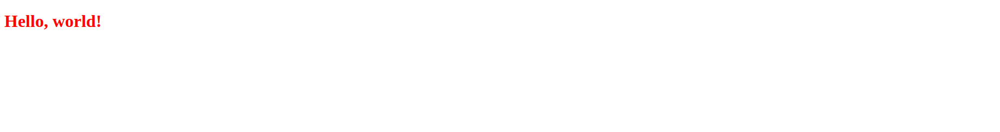

# odin-project-tictactoe
Tic Tac Toe project for The Odin Project: https://www.theodinproject.com/lessons/node-path-javascript-tic-tac-toe

Pardon the dust, this project is under construction!

**Link to project:** https://www.andyglover.io/odin-project-tictactoe/

## How It's Made:

**Tech used:** HTML, CSS, JavaScript

(This is a description of my project!)

## Optimizations

(These are some improvements I would make to this project, given more time!)

## Lessons Learned:

(This is what I learned while working on this project!)

## Examples:
Here's a few more repositories of mine you might like to check out:

**Calculator:** https://github.com/andyglover/odin-calculator

**Rock Paper Scissors:** https://github.com/andyglover/odin-rock-paper-scissors

**GIF Thingy:** https://github.com/andyglover/gif-thingy

**Admin Dashboard:** https://github.com/andyglover/odin-project-admin-dashboard

**ANDYGLOVER.IO:** https://github.com/andyglover/andyglover.github.io

**ANDYGLOVER.DEV:** https://github.com/andyglover/andyglover.dev