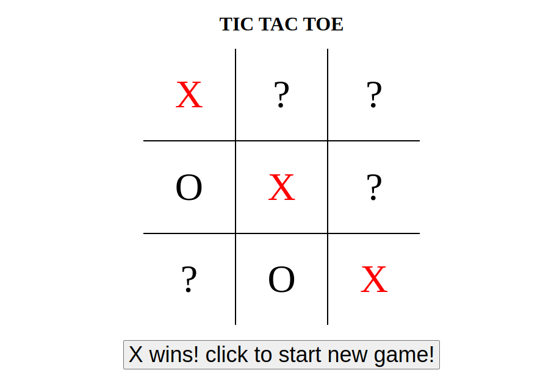

# odin-project-tictactoe
This is my Tic Tac Toe project for [The Odin Project](https://www.theodinproject.com/lessons/node-path-javascript-tic-tac-toe)

**Link to project:** https://www.andyglover.io/odin-project-tictactoe/

## How It's Made:

**Tech used:** HTML, CSS, JavaScript

This is simply "Tic Tac Toe" in Javascript! Click a space to place an "X" then have a friend click to place an "O" (feel free to play as both players if no friend is near)-- the first player to get three in a row wins the game!

## Optimizations

The assignment called for me to allow players the option to set their name, and to also implement a "start game" button, not just a reset button.

## Lessons Learned:

This was my first project that dealt with modules and factory constructors. It gave me a better grasp of how I should be organizing my code. I also learned how to reset an array.

## Examples:
Here's a few more repositories of mine you might like to check out:

**Admin Dashboard:** https://github.com/andyglover/odin-project-admin-dashboard

**Calculator:** https://github.com/andyglover/odin-calculator

**GIF Thingy:** https://github.com/andyglover/gif-thingy

**Library:** https://github.com/andyglover/odin-project-library

**Rock Paper Scissors:** https://github.com/andyglover/odin-rock-paper-scissors